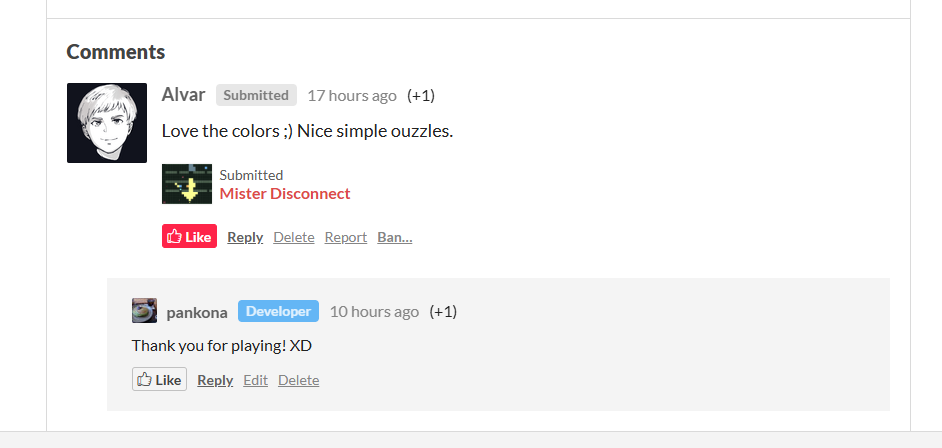

今年も ebitengine game jam に参加した。



提出したゲームはこれ



線を引いて囲みを作り、敵を囲みに入れてやっつけるというパズルっぽいゲームである。ステージクリアすると引いた線や囲みを使って曼荼羅模様が描かれてキレイだぞ、というおまけつき。全10ステージ。ゲームプレイ時間は長くて10分くらいだと思われる。

操作はマウスドラッグ (あるいはスマホならタップ) だけなので、スマホでも遊べるように作ってある。

## 今回のテーマは「Disconnect」

「Disconnect」がテーマということで色々悩み、最初は

「雨が降ってる中を傘をさして帰宅する。傘を足場にしたり振り回したりしないと越えられない障害物があり、しかし濡れすぎるとゲームオーバーで傘をさしてる時間は最小限にしないといけないぞ。傘で雨の世界をさえぎるってあたりが Disconnect 要素だ」

みたいなテーマで作ってみたんだけど、まーつまらなくてボツにした。なんもおもんなかった。不愉快なマリオみたいな感触だった。マリオに失礼な表現かもしれない。

ジャムは2週間しかないのだが、この「つまんねー」って思う段ですでに1週間経っていた。いまさらボツにして完全に別の案で作り直すってのはもはやちょっと微妙なタイミングだったが、まあおもんないと自分が思っちゃったものにしがみつくのもツライしな。ということで別案にした。

新たにひねり出した案 (提出した案) もすんごいおもろいかって言われるとなんとも言えない気持ちだったが、開発途中で子にプレイしてもらったら割と好評だった。まあ子が面白いって言ってくれたからいいか！ということでそのまま進めることにした。作ってるゲームについて、誰かに面白いって言ってもらうのはそれなりに自信につながるのかもしれない。

## AI あるから作るのは速い

ボツにして違うの作ろうって思えたのは AI くんがコードを爆速で書いてくれるから。手で書いてたら最初の案を諦められなかったかもしれない。さっさと作ってあかんそうだったらボツにしてまた違うの作る。こういうスクラップアンドビルドっていうのはいまどきの AI を用いた開発っぽい気がする。

自分はスマホにしゃべりかけて開発を進めていた。キーボードを打っていない。あーでもないこーでもないとしゃべりかけ、出てきたものをちょいと試しにプレイし、またあーでもないこーでもないと言う。ヨギボーにうつぶせに横になってスマホを床に置き、あとはひたすらしゃべりかけ続けるだけである。これが令和最新の開発者の姿だ。ブタかトドか。ブタかトドに失礼な表現かもしれない。ブタやトドのほうがよっぽど必死に生きてそうではある。自分はときどきそのまま寝落ちすることもある。やはりブタやトドと自分を並べるのは失礼だったかもしれねえ。あいつらは寝落ちしないからな。

そんなわけで、ついに一行もコードを確認することなく、ゲームは完成ということにして提出に至った。ゲームジャムっていうのはアイデア勝負みたいなところあるだろうし、まあなんだったら正しいアプローチの仕方なのかもしれない。開発には Claude Code を使い、プランは Max (5x のほう) を使った。Opus しか使わんかったけど Rate limit に悩まされることもなかった。

## AI が速いとはいえ作るのはしんどい

Claude Code でサクサクコードが書けるのはいいんだけど、結局アイデアがでなければ Claude Code に指示することもできない。ゲームをちょいとプレイしてみて、何がつまらんのか、何をどうやったら楽しくなるのかというのは自分で考える必要がある。近頃は考えるのが下手になっている気がする。困ったらすぐに AI に聞いちゃうような生活をしているせいかもしれない。

アイデアを AI に聞いてみてもいいんだけど、実際ちょいちょいアイデアを Claude Code に聞きながら進めたんだが、自分の好みに合わない提案がほとんどだった。いやなんかちょっと違うんだよなーみたいな。自分も何がおもろいのか分かってないので完全にいちゃもんではある。Claude Code はすぐに「これ最高のアイデアです」とか言い始めるのももはや鬱陶しい。君が最高って言った傘ゲーはボツにしたぞ。

あと、AI で高速に開発できるとはいえ、指示からコードができるまでは一瞬ではない。プレイして改善してを繰り返すなら人間のプレイやアイデア出しがボトルネックになる。今回の提出物を作るのに50コミットそこそこ積んでいるが、3日以上はかかっている。結局締め切り直前まで作業していた。締め切りきちゃうーって思いながら作業していた。締め切りの日は月曜日で仕事をしていたので、締め切りの2時間前くらいから休憩をとって作業をしていたぞ……。

## ebitengine game jam 2026 は現在 Voting 中

見たところ、今年は13本のゲームが投稿されたようだ。一応、他の人が作ったゲームを評価する (Voting する) ような建付けになっていて、ジャムの終わりにはランキングが出る。けどまあそれは何位になってもいいんだ。きっとみんなそれぞれに苦労して作ったに違いないし投稿できただけで偉業だ。他のジャム参加者からコメントをつけられる機能もあって、感想が送られてきたりもする。なんとなく感想を言い合って「Thank you for playing! XD」って返すこの時間はなかなか味があると思う。

わいの投稿したゲームについたコメント。ほんわかタイム。タイポしてんぞ

他の方の作品を楽しむまでがゲームジャムである。感謝で味わわせていただこう。
