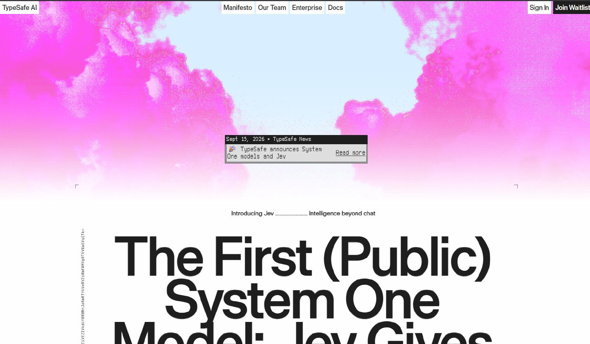
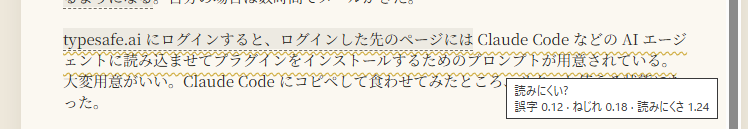

jevってツールが話題なので試してみた。

## jevの試し方



公式ページに行くと、右上に「Join Waitlist」というボタンがある。それを押すとメールアドレスを入れるダイアログが出るので入力する。しばらく待っているとメールが届くので、それに含まれているリンクから色々手続きすると API キーとかが使えるようになる。自分の場合は数時間でメールがきた。

typesafe.ai にサインインした先のページには、Claude Code などの AI エージェントに読み込ませてプラグインをインストールするためのプロンプトが用意されている。大変用意がいい。Claude Code にコピペして食わせてみたところ、サクッと使える状態になった。

## 何ができるんだこれは

jev の使い方としては、まず LLM を使うのと同じように自然言語で質問を投げかけて使う。が、jev は通常の LLM と違ってテキストを出力できない。その代わり、問いに対して、こちらが提示した選択肢のどれにどの程度合致するか、みたいのを返すことができる。そんで通常のテキストが出力できない代わりにとても高速で (500ms くらいで返事がくる) 、しかも安い。出力無料ですって。出力無料ってほんまか。

ちなみに、サインインした直後から $5 のクレジットが付与されている。AI を扱うっていうのに $5 じゃ瞬溶けしちゃうんじゃないのって思うかもしれないが、jev は大変安いので $5 でもまあまあ遊べる。

## もっと具体的に、何ができるんだこれは

たとえば、jev に「この記事 (いま読んでいるこれ) のジャンルは？」って質問して、AI、ポエム、プログラミング、天気、政治、のどれかにしてね、みたいな感じに選択肢を与える。するとそれぞれの選択肢ごとに独立した自信度みたいな数値が 0~1 で返ってくる (あるいは合計で 1 にするのもできる) 。実際にこの記事を jev に食わせてみたらこんな感じだった。

- それぞれ独立の自信度のやつ：AI 0.87、プログラミング 0.8、ポエム0.1、天気 0.04、政治 0.05
- 合計で 1 になるやつ： AI 0.89、プログラミング 0.11、ポエム 0、天気 0、政治 0

なんかまあだいたいあってそう？この値を参考に、勝手にカテゴリ分けするみたいなこともできそうである。

## 世の中の事例

マリオをプレイさせたり、スマブラをプレイさせたりっていう例は見かけた。確かにコントローラーっていう観点では取れる選択は限られていて、それでいて高速に応答してほしい類のユースケースである。 おもろ。

将棋や囲碁もイケるのかな？と思ったけど、どうもそういう「熟考」が必要なケースにはあまり向かないようだ。そういう時間をかけていい類のものは通常の LLM の得意分野かもしれない。

逆アキネイターみたいのもあった。高速に動くし、「はい」か「いいえ」で答えるだけだし、jev の機能を理解するって意味ではいい例っぽい気がする。



## 雑感：うまく使えればすごく便利そう

自分が jev を一日こねまわしてみて思ったことは、

- LLM で良いなら LLM を使えばいい
- コードで if 文を書いて済ませられるなら if 文で済ませればいい
- それらでは済まないところには jev が使えるかもしれない

みたいな感じ。LLM は遅いし高いが、すごく柔軟に色々やってくれる。コードを書いて分岐を書くのはめちゃくちゃ高速で安いが、原則としてあらかじめ書いたようにしか分岐してくれない。

それらでは済まないというのは、「それなりに頻繁に叩きたいんだけど、ルールベースのコードに落とし込むのはちょっと難しい分岐をしたい」みたいなやつ。

自分が思ったユースケースは、たとえば、

- AI にコードレビューをしてもらうとして、色んな観点でレビューするサブエージェントを起動するような場合。そのままレビューを実行するとそれなりにトークンを食うんだけど、「あきらかにこの観点ではレビューしなくていいよね」みたいのを jev に前捌きしてもらう。不要なサブエージェントが起動しなくなってトークンに優しい、みたいな。場合によっては何もレビューしなくていいぞって判定してくれる場合もあるかもしれない。
- 自分がいま書いている日本語が読みやすいかをリアルタイムで判定してもらう。日本語 lint みたいなね。一文ずつ jev に食わせて、主述がねじれているか、誤字があるか、読みやすいか、という選択肢をあたえて、いずれかの観点で一定値を超えたら警告を出す。保存のたびに実行するだとか、一文ずつにわけて実行するだとかって考えると通常の LLM ではちょっと重たすぎる。jev ならとりあえず「改善の余地がありそうだぞ」くらいの臭いを察することができて便利。だいたい書き上がったらまとめて LLM に時間をかけてレビューしてもらったらいいと思うよ。

「読みにくさ」って言われても曖昧なので、jev に渡すレビューの観点はもうちょっと丁寧に作ったほうが便利になりそう。とはいえこの程度の雑さでも「まあ確かにちょっとこの文は読みにくいか？」くらいの気付きは与えてもらえる。保存のたびに高速に見てもらえるのも便利。あと不便だったらいちいちプロンプトや選択肢を調整すればいいからね。トライアンドエラーが高速に回せるのも良いところよ。

jev がピタッとハマるユースケースってそんなに多くない気もするんだけど、しかしハマるところは「jev でなきゃダメだな」ってなりそうである。
