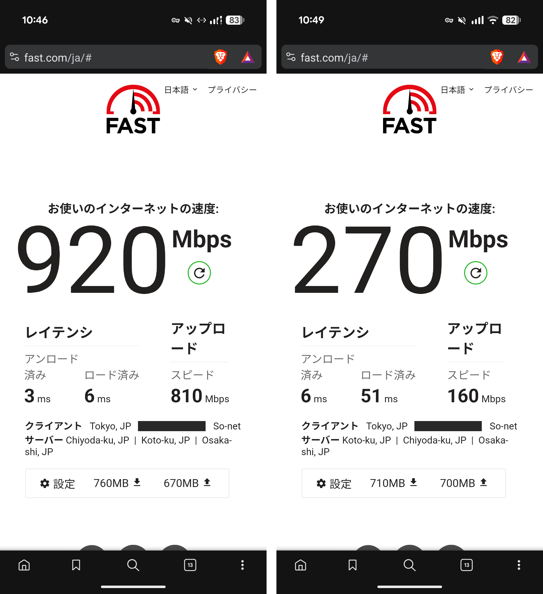

自室でネットワークに接続しようと思ったら無線LANを使うしかなかった。しかし業務にせよオンラインゲームにせよ、やっぱり有線LANがいいよーっていうケースがしばしばある。年末に発売するであろうダスクブラッドも有線LANで遊びたい。なんとか有線LANを自室に引き回すことはできないか？

## 我が家

戸建で二階建て。一階のほぼ中央に光ファイバーがきていて、同じところにONUやらルーターやらが固めて置いてある。

自室は二階。LANケーブル這わせたらたぶん20mくらいは必要。

## 工務店さんに見てもらったらCD管が発見された

ネットワーク機器の大元 (ONUとか呼ばれる) は我が家の一階にある。自室は二階である。愚直に考えると、ひたすら長いLANケーブル用意して一階から二階まで引き回さねばならない。壁やら天井やらに這わせることになるだろう。面倒だし見た目も悪い。

ということで、とりあえず近所の工務店さんにメールをしてみた。有線LANを一階から二階まで這わせたいんだがキレイにやってくれんかーと。工務店さん曰く、やりまっせーと。

ひとまず現場の下見ということで現れた電気屋の兄ちゃんは、あちこち開けたり閉めたりしたあとに「壁の中にCD管があるから這わせる必要ないっすよ。壁の中にLANケーブル通せますっすよ」との見解を示した。マジっすか。壁内にCD管は通ってないつもりだったんだが、実は通っていたのか。なんでなんだろう……。

※ 我が家は概ね注文住宅である。設計のときにCD管の有無のチョイスもさせられており、工賃をケチった自分は「なしで」と回答したのだった。一部屋あたり7万円くらいで、一通りやると50万円くらいだったんだよね。で、ケチった。いま思えば一生後悔するチョイスだったと思っていたのだが、はて……。妻の仕業か……？孔明……？

実はCD管ないんですよーケチっちゃってーなんて工務店さんには説明してたんだけど、疑ってもらってよかった。割とあるあるな話なのかもしれない。

## 有線LAN速え

で、本日 (2026/09/04) 敷設作業をしてもらい、晴れて自室のコンセントにLANの口が設置された。工事は一時間くらいで終わった。今回は兄ちゃんではなかった。どちらかというと爺ちゃんがやってくれた。電気工事サクサクやってくれる爺ちゃん、安心感がある。

試しに fast.com でスピードテストしてみたが、ちゃんと下りで1Gbpsくらいの速度が出るし (機器的に概ね理論値)、何よりレイテンシが無線LANに比べて8〜10分の1くらいになった。レイテンシ6msって数字はひさしく見ていなかった。これなら格闘ゲームもできる水準なのでは？ひさしぶりに鉄拳でもやるか？

左が有線LAN、右が無線LAN。

これはスマホ (Pixel 10 Pro XL) で計測した。

## お値段は一部屋で7万円くらい

CD管に有線LANを通してLANの口をしつらえる工事と言えるだろうか。ちなみにケーブルはカテゴリ6を指定しておいた。

一部屋やってもらって、お値段は概ね7万円だった。家を建てる当時にケチった値段とあんま変わらんな？つまり当時も、CD管は入れとくけどケーブルは入れないよって話だったのかもしれない。記憶がない。

アマゾンでスイッチングハブとLANケーブルを発注した。これで安心してオンラインゲーム等に臨める。

## 無線LANだと通信状況が良くてもラグるという話

ところで、無線LANを使っていてスピードテストでも十分な上り下り速度やレイテンシが得られたとしても、それでも無線LANを使っているとオンラインゲームではラグってしまうよ、という話を聞いた。理解が浅いので詳しく説明できないが。

この話は半二重とかエアタイムの取り合いとか、そういう単語で調べていくと色々研究が出てくる。「普通の有線LAN >>> (越えられない壁) >>> 通信状況の良い無線LAN」という話っぽいとうすらぼんやり理解している。

エルデンリングナイトレインとか 7 days to die とか、ここ数年も数々のオンラインゲームを無線LANでやってきた自分である。快適にプレイしていたつもりだったが、快適だったのは自分だけで実はご一緒してた方々はラグラグしちゃってたのかもしれない。ごめんね。でももう大丈夫さ。
