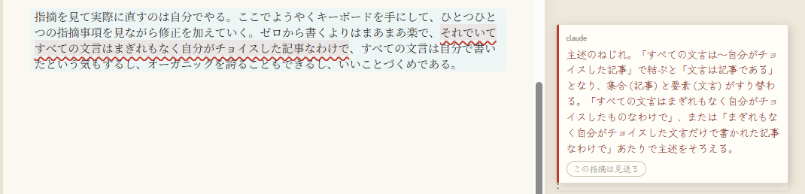
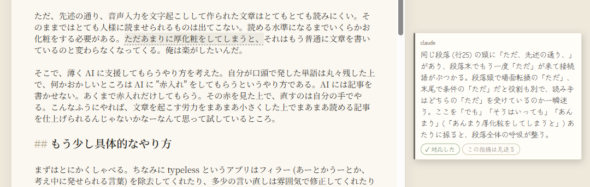

# 音声入力でブログを書けるか

typeless というアプリを使って、音声入力でブログを書くことを試している。

キーボードを叩くより音声入力のほうがスピードが速い。これはどうやら間違いない。だったらブログを書くのだって速くできるんじゃないの？みたいな安直な発想である。で、試してみた。この記事は音声入力を使って書かれている……。少なくとも下書きは。

## 思ったよりそんなに簡単ではない

思ったことを口頭でしゃべったとき、口から出た言葉がそのまま読みやすい文章になるかというと全然そんなことはない。しゃべったものを文字起こしして読んでみると、当たり前だがそれは完全に口語な文章である (音声入力だからそれはそう) 。これがそれはそれはとてもとても読みにくい。文章として破綻している場合すらある。主語が抜けていたり、しゃべっているうちに主述がねじれてしまったりする。そういうのに気をつけながら最初っからブログ記事っぽいしゃべり方をすればいいじゃない、みたいな発想もあるかもしれないが、そんなしゃべり方は少なくとも訓練なしにはできない気がする。自分はできなかった。

音声入力によるブログ記事作成にトライしたのは初めてではない。2026年2月くらいにも一回トライしていたが、上述のような理由でうまくいかず、もはやまるっきり諦めていた。ちゃんとキーボードに向き合い、「ああでもない、こうでもない」「この文は読みやすい、この文は読みにくい」と推敲しながら一文ずつ進んでいく。そうしなければ、結局ブログというのは書き上がらないんだと、その段階では判断していた。

## ところで、AI がまるまる書いた記事って読む気にならないんだよな

最近は AI がすごく進化している。OpenAI のやつもすごいし Anthropic のやつもすごい。Fable を使うと、あまり工夫をしなくてもだいぶまともな日本語が出力されるような気がする。昨今では AI にブログをまるっと書いてもらうような例も珍しくない。

しかし、なんというか、AI が書いた記事ってあんまり読む気にならない。理由はぶっちゃけよくわからない。そもそも AI がまるまる書いた文章は読みづらいものになる傾向があるらしい。だけど仮にそれが読みやすかったとしても、AI がまるっと書いたんですよーって言われるとそれだけで読む気がそがれる。文がキレイだとしても読みたくないって思っちゃうんだから、つまり自分は文章になにかもっと "人間のぬくもり" 的なものを求めているのかもしれない。俺は文章にオーガニックを求めている。

ちなみにこれはブログ記事のような対人間に読ませる文章の話であって、AI が書いたものでも、業務で扱うコードなんかはまあまあ読もうっていう気になる。

## 音声入力を文字起こししてからちょっと加工したものはセーフか？

一方で、自分から発せられた言葉だけでできている文章なのであれば、それは実質「自分で書いた」と言っても差し支えないはずである。"AI がまるっと書いたものは読みたくないが人間が書いたものなら読みたい" というのが真だとすれば、音声入力された文章は一応、セーフとして分類されるような気がするがはたしてどうか。

ただ、先述の通り、音声入力を文字起こしして作られた文章はとてもとても読みにくい。そのままではとても人様に読ませられるものは出てこない。読める水準になるまでいくらかお化粧 (手で文章を書き直すということ) をする必要がある。そうはいってもあんまり厚化粧をしてしまうとそれはもう普通に文章を書いているのと変わらなくなってくる。俺は楽がしたいんだ。

そこで、薄く AI に支援してもらうやり方を考えた。自分が口頭で発した単語は丸々残した上で、何かおかしいところは AI に "赤入れ" をしてもらうというやり方である。AI には記事を書かせない。あくまで赤入れだけしてもらう。その赤を見た上で、直すのは自分の手でやる。こんなふうにやれば、文章を起こす労力をまあまあ小さくした上でまあまあ読める記事を仕上げられるんじゃないかなーなんて思って試しているところ。

## もう少し具体的なやり方

まずはとにかくしゃべる。ちなみに typeless というアプリはフィラー (あーとかうーとか、考え中に発せられる言葉) を除去してくれたり、多少の言い直しは雰囲気で修正してくれたりする便利な音声入力アプリである。この typeless による文字起こしの段階ですでに AI が入っているのだが、まあ、言うても自分がしゃべった単語はだいたいちゃんと残してくれるからね。大丈夫。セーフ。まだオーガニック。

で、出てきたものにまず静的解析をかける。自分はとりあえず textlint を試している。textlint を使うと読みにくい日本語、たとえばやたら一文が長いとか、ですます調とである調がまざっているとか、その手のどうあがいても潰しといたほうがいい部分を洗ってもらえる。音声入力された文章のひどさと言ったらなかなかのものなので、まずはこれでギリギリ読める水準まで修正する。割と機械的な直しになることが多いので、この作業までは AI にやってもらってもいいかもしれない。まだセーフ。まだオーガニック。

textlint でひっかけられないところは AI にレビューしてもらう。文字起こししたものを読んでみると、自分の場合は「ひとフレーズの中に同じ言葉が何度も出てくる」「一文が長くなりすぎる」「主述がねじれる」「そもそも主語も述語もなくて何を言ってるのか意味不明」みたいな症状がしょっちゅう現れることがわかる。読んでて気持ち悪くなる。自分でしゃべったんですけどね……！

AI には「気持ち悪い文章になっているから、おかしい箇所を指摘してください。」とお願いする。するとまあまあちゃんと指摘してくれる。今回は Fable を medium effort で使ってレビューしてもらった。こんな記事を見てもらうのに Fable 先生を使ってしまってすまない。まあきっと Sonnet でも Opus でもまあまあやってくれると思う。たぶん。

指摘を見て実際に直すのは自分でやる。ここでようやくキーボードを手にして、ひとつひとつの指摘事項を見ながら修正を加えていく。ゼロから書くよりはまあまあ楽で、それでいてまぎれもなく自分がチョイスした文言だけで書かれた記事なわけで、ちゃんと自分で書いたという気もするし、オーガニックを誇ることもできるし、いいことづくめである。

## そこまで時短にならないかもしれんが筆不精にはいいかも

実際やってみた結果、この記事 (およそ3,000文字) を書き終わるのに2〜3時間くらいかかっている。

自分の場合、2,000文字程度の記事は30分から1時間くらいで書き終わることが多い。それを思うと、今のところはむしろ余計に時間がかかっている可能性が高い。ウケる。

今回は赤入れをしてもらうためのエディタを脇で作るようなことも一緒にやっているので、すべての時間を文章の執筆に充てているわけではない。が、音声入力をしたほうがざっくりで倍以上の時間がかかっているような雰囲気ある。

だけど、だからといってこの手法が全然役に立たなくてお払い箱にするべきかというと、実はそこまで捨てたものではないという気もしている。何よりまず「しゃべり始めることでブログを書き始めることができる」という点に、執筆し始めのハードルを下げる効能がありそう。ブログを書くうえで何が一番ツライって書き始めるところだからね。書き始めたら案外サクサク書けたりするもんだ (当社比) 。

ひとつの記事を書き上げる時間が多少延びたとしても、それで書き始めるハードルが下がって書く頻度を上げられるなら、それはハッピーと言えそう。実際に記事として成立させたのはまだこれがひとつ目なので、もう少しやり方をブラッシュアップさせていけば、もっと速く書けるようになるのかもしれない。